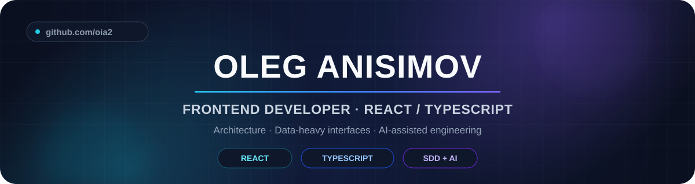
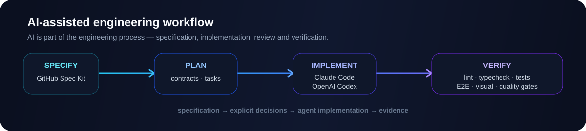

<!--
Palette
#0B1020 — deep navy
#111B3A — surface
#22D3EE — cyan
#3B82F6 — blue
#8B5CF6 — violet
-->

<p align="center">
  
</p>

<p align="center">
  
</p>

<p align="center">
  <a href="https://t.me/BoostMongoose">
    
  </a>
  <a href="https://www.linkedin.com/in/oleg-anisimov-a232113b7/">
    
  </a>
  <a href="https://github.com/oia2">
    
  </a>
</p>

<br/>

## `> whoami`

```yaml
name: Oleg Anisimov
role: Frontend Developer
location: Krasnoyarsk, Russia
experience: 1.5+ years commercial

focus:
  - React / TypeScript
  - complex data-heavy interfaces
  - frontend architecture
  - API-driven applications
  - AI-assisted software development

engineering:
  - build features from specification to verification
  - keep architecture boundaries explicit
  - automate quality checks
  - prefer measurable behavior over implicit assumptions
```

---

## `> tech-stack`

<h3 align="center">Frontend</h3>

<p align="center">
  
</p>

<p align="center">
  
  
  
  
</p>

<h3 align="center">Testing & quality</h3>

<p align="center">
  
  
  
  
</p>

<h3 align="center">Backend & infrastructure</h3>

<p align="center">
  
</p>

<p align="center">
  
  
  
  
</p>

---

## `> ai-assisted-development`

### 🤖 Разработка с использованием ИИ

<p align="center">
  
</p>

Использую Claude Code и Codex для агентной разработки, GitHub Spec Kit — для работы со спецификациями, Open Design — для проработки интерфейсов.

<p>
  
  
  
  
</p>

<p align="center">
  
</p>

<p align="center">
  
</p>
